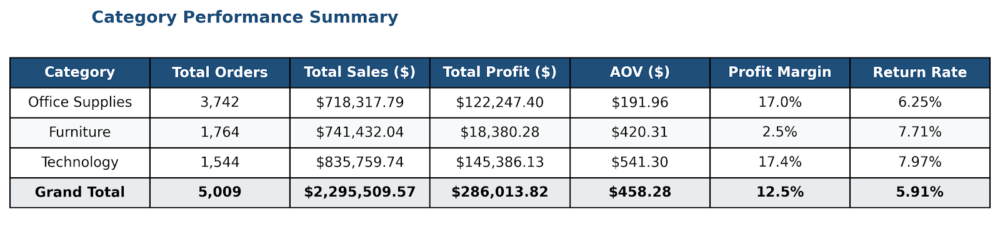
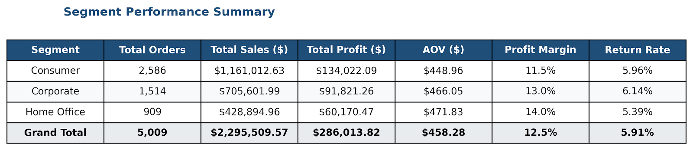

# Retail Profitability & Business Analytics

An end-to-end commercial analytics project evaluating retail sales performance, product margins, customer segments, and discount strategies to eliminate profit leakage using Python, Excel, and Power BI.

## Project Overview

This project analyzes the Superstore dataset to uncover profit drivers and structural margin drains across sales categories, sub-categories, customer segments, and discount tiers. 

Excel and Python were used for initial data cleaning, transformation, and statistical exploration, while clear structured summary tables and visual analytics were developed to highlight high-impact business insights.

The project focuses on addressing high-volume, low-margin categories (such as Furniture) and identifying optimal discount thresholds to maximize profitability.

## Tools & Technologies

- **Microsoft Excel** – Initial data inspection, cross-tabulation, and pivot summaries
- **Python (Pandas, Matplotlib, Seaborn)** – Data cleaning, aggregation, margin computations, and visualization generation
- **Power BI / Business Intelligence** – Exploratory data analysis, KPI calculation, and interactive dashboarding

## Dashboards & Visualizations

### Visual Insights Summary

Provides clear, neat visual breakdowns of profit drains versus key performance drivers across product sub-categories and discount tiers.


## Analysis Areas

The analysis focuses on the following key areas:

- **Category Performance** – Comparative breakdown of high-performing vs. low-margin product categories
- **Segment Insights** – Order distributions, sales volume, and margin profiles across Consumer, Corporate, and Home Office clients
- **Sub-Category Profit Impact** – Identification of top profit drivers (e.g., Copiers, Phones) and profit drains (e.g., Tables)
- **Discount & Pricing Strategy** – Analysis of margin drop-offs across incremental discount tiers
- **Fulfillment & Returns** – Correlation analysis between product categories, return percentages, and average order values (AOV)

## Summary Insights

### Category Performance Summary

| Category | Total Orders | Total Sales ($) | Total Profit ($) | AOV ($) | Profit Margin | Return Rate |
| :--- | :---: | :---: | :---: | :---: | :---: | :---: |
| **Office Supplies** | 3,742 | $718,317.79 | $122,247.40 | $191.96 | 17.0% | 6.25% |
| **Furniture** | 1,764 | $741,432.04 | $18,380.28 | $420.31 | 2.5% | 7.71% |
| **Technology** | 1,544 | $835,759.74 | $145,386.13 | $541.30 | 17.4% | 7.97% |
| **Grand Total** | **5,009** | **$2,295,509.57** | **$286,013.82** | **$458.28** | **12.5%** | **5.91%** |



### Customer Segment Performance Summary

| Segment | Total Orders | Total Sales ($) | Total Profit ($) | AOV ($) | Profit Margin | Return Rate |
| :--- | :---: | :---: | :---: | :---: | :---: | :---: |
| **Consumer** | 2,586 | $1,161,012.63 | $134,022.09 | $448.96 | 11.5% | 5.96% |
| **Corporate** | 1,514 | $705,601.99 | $91,821.26 | $466.05 | 13.0% | 6.14% |
| **Home Office** | 909 | $428,894.96 | $60,170.47 | $471.83 | 14.0% | 5.39% |
| **Grand Total** | **5,009** | **$2,295,509.57** | **$286,013.82** | **$458.28** | **12.5%** | **5.91%** |



## Key Insights

* **Technology generated the highest total profit**, contributing **$145.4K** at a **17.4% profit margin**, driven by strong demand for Copiers and Phones.
* **Furniture suffers from severe margin dilution**, generating **$741.4K in sales** but only **$18.4K in profit (2.5% margin)** due to heavy discounting on Tables and Bookcases.
* **Tables represent the single largest profit drain**, recording a net loss of **-$17,725**.
* **Discounting beyond 20% severely destroys unit economics**, causing profit margins to plummet to negative values (e.g., **-180% margin loss at 80% discount**).
* **Home Office is the most profitable customer segment** on a margin basis (**14.0% margin**, **5.39% return rate**), despite generating fewer overall orders than the Consumer segment.
* **Overall return rate averaged 5.91%**, with Technology experiencing the highest category return rate at **7.97%**.

## Skills Demonstrated

- Exploratory Data Analysis (EDA)
- Profitability & Pricing Analysis
- Data Visualization & Formatting
- Business Intelligence Reporting
- Data Cleaning & Transformation
- Metric Calculation & Aggregation (AOV, Profit Margin %, Return Rate %)
- Microsoft Excel
- Python (Pandas, Matplotlib, Seaborn)
- Business Strategy & Recommendation Modeling

## Project Structure

```text
Retail-Profitability-and-Business-Analytics/
│
├── assets/
│   └── assets/
│       ├── category_performance_summary.png
│       ├── segment_performance_summary.png
│       ├── portfolio_chart1_subcat_clean.png
│       └── portfolio_chart2_discount_clean.png
└── README.md
'''
## Conclusion

This project demonstrates how data analysis can reveal critical pricing inefficiencies and operational profit leaks in retail operations. By combining data aggregation, clear summary tabular models, and targeted visual breakdowns, the analysis translates complex transaction logs into actionable commercial strategies.

Addressing excessive discounting protocols and optimizing the product line for high-margin segments will immediately improve overall organizational profitability without sacrificing revenue volume.

## Future Scope

* **Dynamic Price Elasticity Modeling:** Develop regression models to estimate sales volume changes relative to discount adjustments.
* **Customer Lifetime Value (CLV) Tracking:** Measure long-term retention and repeat order behavior across customer segments.
* **Geographic Profit Mapping:** Analyze state- and city-level profitability to identify regional logistics costs or regional discounting excesses.
* **Automated Alerting Thresholds:** Integrate automated Power BI / Python alerts to notify sales teams when discounts exceed the 20% profitability tipping point.
