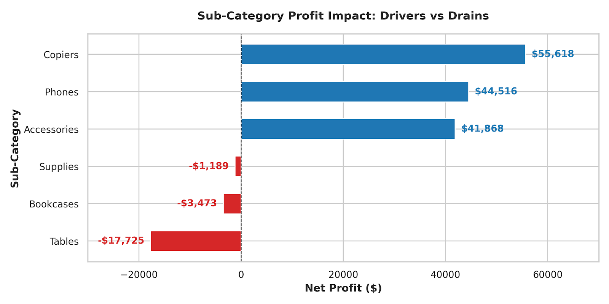
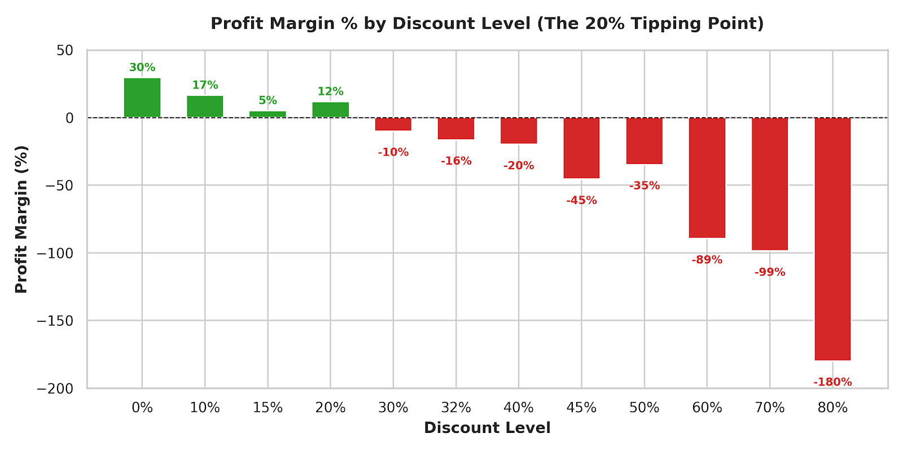

# 🛍️ Retail Profitability & Business Analytics: Uncovering Margin Leakage

Welcome! This project dives deep into e-commerce transactional data to answer a critical commercial question: **Where is our revenue actually going, and why aren't high sales translating into bottom-line profit?**

By moving beyond standard surface-level dashboards, this analysis uses Python, Excel, and Power BI to pinpoint structural profit drains, evaluate customer segment dynamics, and identify the exact discount threshold where profitability collapses.

---

## 🎯 Business Questions Addressed

To drive actionable strategy, this analysis was structured around four core business questions:

1. **The Revenue vs. Profit Paradox:** Which product categories generate massive sales volume but fail to deliver meaningful net profit?
2. **The Discount Tipping Point:** At what specific discount percentage do transactions cross from profitable to value-destroying?
3. **Sub-Category Drivers vs. Drains:** Which specific products are carrying the business, and which ones are actively bleeding cash?
4. **Segment Economics:** Which customer segments (Consumer, Corporate, or Home Office) deliver the healthiest margins and highest Average Order Values (AOV)?

---

## 🛠️ Tools & Technologies

* **Python (Pandas, Matplotlib, Seaborn)**: Advanced data cleaning, custom margin aggregations, and visual charting
* **Microsoft Excel**: Pivot validation, transactional spot-checks, and preliminary data exploration
* **Power BI & Business Intelligence**: Multi-dimensional EDA, metric creation (AOV, Margin %, Return Rate %), and scenario testing

---

## 📊 Summary Performance Tables

### 1. Category Performance Breakdown

| Category | Total Orders | Total Sales ($) | Total Profit ($) | AOV ($) | Profit Margin | Return Rate |
| :--- | :---: | :---: | :---: | :---: | :---: | :---: |
| **Office Supplies** | 3,742 | $718,317.79 | $122,247.40 | $191.96 | 17.0% | 6.25% |
| **Furniture** | 1,764 | $741,432.04 | $18,380.28 | $420.31 | 2.5% | 7.71% |
| **Technology** | 1,544 | $835,759.74 | $145,386.13 | $541.30 | 17.4% | 7.97% |
| **Grand Total** | **5,009** | **$2,295,509.57** | **$286,013.82** | **$458.28** | **12.5%** | **5.91%** |

### 2. Customer Segment Performance

| Segment | Total Orders | Total Sales ($) | Total Profit ($) | AOV ($) | Profit Margin | Return Rate |
| :--- | :---: | :---: | :---: | :---: | :---: | :---: |
| **Consumer** | 2,586 | $1,161,012.63 | $134,022.09 | $448.96 | 11.5% | 5.96% |
| **Corporate** | 1,514 | $705,601.99 | $91,821.26 | $466.05 | 13.0% | 6.14% |
| **Home Office** | 909 | $428,894.96 | $60,170.47 | $471.83 | 14.0% | 5.39% |
| **Grand Total** | **5,009** | **$2,295,509.57** | **$286,013.82** | **$458.28** | **12.5%** | **5.91%** |

---

## 💡 Key Visual Insights

### Sub-Category Profit Drivers vs. Drains


### The Discount Tipping Point (Margin Destruction)


---

## 🔥 Key Takeaways

* **Technology is the main driver:** Generates **$145.4K in net profit** with a **17.4% margin**, led by high-demand items like Copiers and Phones.
* **Furniture needs attention:** Despite bringing in **$741.4K in sales**, it keeps a thin **2.5% profit margin** ($18.4K total profit).
* **The "Tables" issue:** Tables are the worst-performing sub-category in the dataset, leading to a **-$17,725 net loss**.
* **The 20% Discount Threshold:** Discounts up to 20% keep profitability steady. Once discounts pass **20%**, margins fall into negative territory (dropping to **-180%** at extreme levels).
* **Home Office performance:** Generates lower order volume but yields the highest profit margin (**14.0%**) and lowest return rate (**5.39%**).

---

## ⚡ Skills Applied

* **Commercial & Financial Analytics:** Pinpointing pricing gaps, profit leaks, and margin drops
* **Exploratory Data Analysis (EDA):** Slicing data across customer, product, and promo dimensions
* **Data Visualization & Storytelling:** Building charts tailored for clear decision-making
* **Key Metric Calculation:** Computing business KPIs like AOV, Profit Margin %, and Return Rates

---

## 📁 Repository Structure

```text
Retail-Profitability-and-Business-Analytics/
│
├── assets/
│   └── assets/
│       ├── portfolio_chart1_subcat_clean.png
│       └── portfolio_chart2_discount_clean.png
│
├── data/
│   └── Superstore Data set.xlsx
│
└── README.md
```

## Conclusion

This project demonstrates how data analysis can reveal critical pricing inefficiencies and operational profit leaks in retail operations. By combining data aggregation, clean markdown summary models, and targeted visual breakdowns, the analysis translates complex transaction logs into actionable commercial strategies.

Addressing excessive discounting protocols and optimizing the product line for high-margin segments will immediately improve overall organizational profitability without sacrificing revenue volume.

## Future Scope

* **Dynamic Price Elasticity Modeling:** Develop regression models to estimate sales volume changes relative to discount adjustments.
* **Customer Lifetime Value (CLV) Tracking:** Measure long-term retention and repeat order behavior across customer segments.
* **Geographic Profit Mapping:** Analyze state- and city-level profitability to identify regional logistics costs or regional discounting excesses.
* **Automated Alerting Thresholds:** Integrate automated Power BI / Python alerts to notify sales teams when discounts exceed the 20% profitability tipping point.
